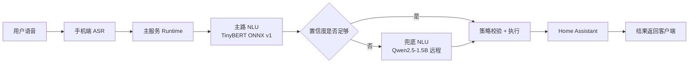
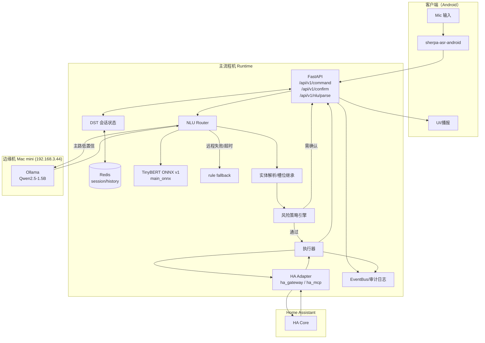
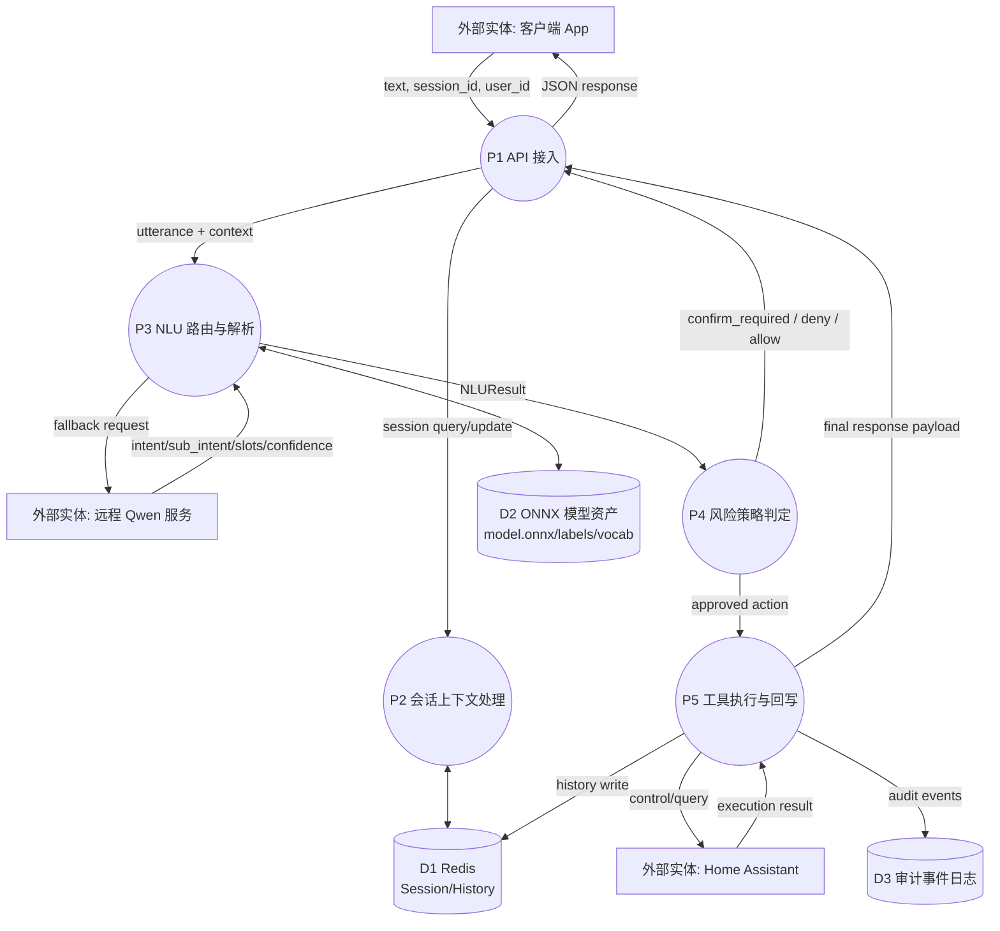

# SmartHome NLU 架构流程图与数据流图

## 1. 高层架构流程图（管理/评审）

## 2. 详细工程流程图（开发联调）

## 3. 数据流图（DFD-L1）

## 4. 说明
- 主路优先：`TinyBERT ONNX v1` 承担低延迟高频意图识别。
- 兜底触发：主路低置信或异常时调用远程 `Qwen2.5-1.5B`。
- 最终动作必须经过策略层校验，高风险操作进入确认流程。
- 数据闭环落到 Redis 与审计日志，支持回放、排障与指标统计。
