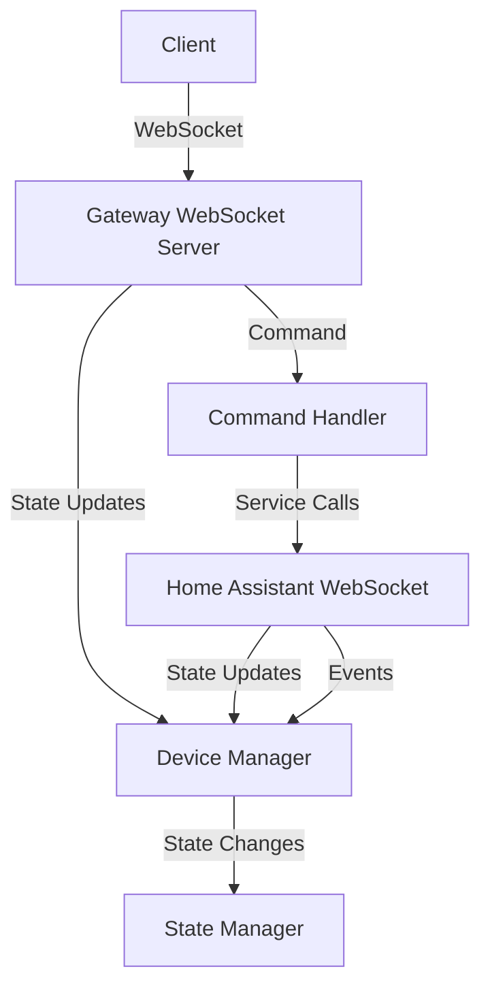

# Home Assistant Gateway Architecture

## Overview

The Home Assistant Gateway is a standalone application that bridges external clients with Home Assistant through a WebSocket interface. It provides device discovery, state synchronization, and service execution capabilities.

## System Architecture

## Components

### 1. Core (`core.py`)
- **HomeAssistantGateway**: Main gateway orchestrator
- Coordinates all components
- Handles startup/shutdown lifecycle
- Manages signal handlers for graceful shutdown

### 2. Configuration (`config.py`)
- **Config**: Main configuration class
- **Config validation**: Ensures required settings are present
- **Default values**: Provides sensible defaults
- **File I/O**: Save/load YAML configuration

### 3. Authentication (`auth.py`)
- **Authenticator**: Handles authentication with Home Assistant
- Supports multiple auth types:
  - Long-lived tokens
  - Username/password
  - OAuth2 (placeholder)
- Token refresh management
- SSL/TLS configuration

### 4. Device Management (`device_manager.py`)
- **Device**: Device representation with metadata
- **DeviceManager**:
  - Discovers and manages devices
  - Tracks device states
  - Detects device capabilities
  - State change callbacks

### 5. State Management (`state_manager.py`)
- **StateManager**:
  - Maintains device states
  - State history tracking
  - State change watching
  - Statistics generation

### 6. Command Handling (`command_handler.py`)
- **CommandHandler**: Processes client commands
- Supports:
  - Get/set entity states
  - Service calls
  - Subscriptions
  - Device discovery
- Command queuing and processing

### 7. Client Management (`client.py`)
- **ClientManager**: Manages connected clients
- Client authentication
- Subscription management
- Idle client cleanup
- Statistics

### 8. Protocol (`protocol/`)
- **Message**: Protocol message format
- **WebSocket**: WebSocket protocol implementation
  - Home Assistant WebSocket client
  - Gateway WebSocket server

## Data Flow

### Client Commands
1. Client sends WebSocket message
2. Gateway server receives message
3. Command handler processes command
4. Execute action (get/set state, call service)
5. Response sent back to client

### State Changes
1. Home Assistant state changes
2. HA WebSocket receives event
3. Device manager updates state
4. State manager records change
5. Gateway broadcasts to subscribed clients

## Design Patterns

### 1. Observer Pattern
- Device state changes notify listeners
- Clients subscribe to state updates
- Event-driven architecture

### 2. Strategy Pattern
- Authentication strategies (token, password, OAuth)
- Different device type handlers

### 3. Factory Pattern
- Device capability detection
- Message creation utilities

### 4. Command Pattern
- Client commands as first-class objects
- Command queuing and processing

## Performance Considerations

### Connection Management
- Connection pooling for Home Assistant
- Client connection limits
- Idle timeout handling

### State Synchronization
- Batched state updates
- State caching with TTL
- Delta updates where possible

### Resource Management
- Async I/O throughout
- Proper cleanup on shutdown
- Memory usage monitoring

## Security

### Authentication
- Token-based authentication
- Client isolation
- Role-based access control (future)

### Network Security
- WebSocket encryption (WSS support)
- Input validation
- Rate limiting (future)

## Extensibility

### Adding New Device Types
1. Extend Device capabilities in device_manager.py
2. Add state handling in command_handler.py
3. Update protocol message handling

### Adding New Features
- Protocol versioning support
- Plugin architecture for extensions
- Configuration-driven feature toggles

## Error Handling

### Graceful Degradation
- Network reconnection attempts
- Command retry logic
- Fallback behaviors

### Error Propagation
- Structured error messages
- Logging at appropriate levels
- Client error responses

## Monitoring

### Metrics
- Client connection counts
- Command processing rates
- State update frequency
- Error rates

### Logging
- Structured logging
- Configurable log levels
- Performance logging options