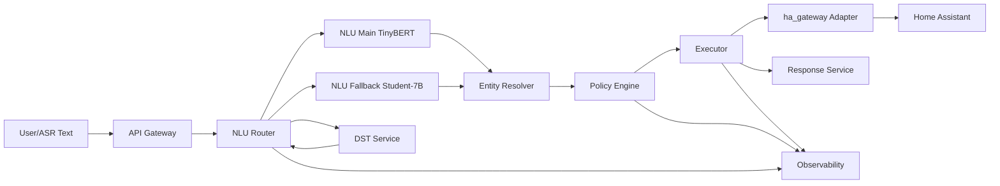

# SmartHome NLU 架构设计（模块划分）

## 文档信息
- 文档名称：SmartHome NLU 架构设计（模块划分）
- 版本：v2.0
- 日期：2026-04-03
- 基线文档：端到端智能家居对话意图识别系统 v3.1
- 适用范围：运行时链路（ASR 文本输入到设备执行）与离线训练链路（难例回流到模型发布）

## 1. 目标与范围

### 1.1 端到端数据流
用户说话 → ASR 转文字 → NLU 意图识别（主路 / 兜底） → 结构化 JSON 意图 → ha_gateway 工具调用 → Home Assistant REST/WebSocket → 设备执行 → 结果 TTS 播报。整条链路运行时完全本地，用户隐私数据不出局域网。

### 1.2 设计目标
1. 在线链路低延迟与高可用：端到端控制路径 P99 < 1200ms。
2. 模块边界清晰：意图理解、对话状态、执行控制、策略审计解耦。
3. 离线可持续迭代：执行反馈可稳定回流到数据与蒸馏训练流水线。
4. 安全与合规：高风险指令可控，调用全量可审计。

### 1.3 设计原则
1. **完全本地**：语音、NLU、设备控制全链路不出局域网。
2. **运行时零云依赖**：推理链路不调用任何外部 API；训练时 Teacher 重标注为可选离线批处理。
3. **协议标准**：通过 MCP 标准协议与 Home Assistant 通信，天然兼容未来扩展。
4. **数据飞轮**：ha_gateway 执行反馈（成功/失败）反哺 NLU 难例队列，持续提升。
5. **失败可恢复**：重试、降级、幂等、二次确认为内建机制。
6. **默认最小权限**：工具白名单 + 参数白名单 + 审计落盘。

## 2. 意图与槽位体系

### 2.1 意图分类

| 顶级意图 | 子意图示例 | 典型话语 | ha_gateway 对应工具 |
|---|---|---|---|
| CONTROL | 开关/亮度/温度/颜色 | 把客厅灯调到 50% | ha_call_service (light/climate) |
| QUERY | 设备状态/用电量/传感器 | 现在客厅温度多少 | ha_get_entity / ha_get_history |
| SCENE | 回家/离家/睡眠/观影 | 打开回家模式 | ha_call_service (scene.turn_on) |
| SCHEDULE | 定时开关/倒计时 | 30 分钟后关空调 | ha_create_automation |
| AUTOMATION | 创建/修改/删除规则 | 温度超 28 度自动开空调 | ha_create_automation / ha_update_automation |
| SYSTEM | 重启/备份/更新 | 备份一下 HA | ha_create_backup |
| CHITCHAT | 闲聊/超范围 | 你好 / 今天天气 | 无（直接 TTS 回复） |

### 2.2 核心槽位与 ha_gateway 实体映射

| 槽位 | 类型 | 示例值 | ha_gateway 映射逻辑 |
|---|---|---|---|
| device_type | 枚举 | 灯/空调/门锁 | ha_search_entities(query=device_type) |
| location | 枚举 | 客厅/卧室/全屋 | 过滤 area=location |
| attribute | 枚举 | 亮度/温度/颜色 | 映射为 HA service 参数 |
| value | 数值/字符串 | 50% / 26℃ / 暖白 | 作为 service_data 字段值 |
| entity_id | 字符串 | light.living_room | 直接传入 ha_call_service |
| scene_name | 字符串 | 回家模式 | ha_search_entities(domain=scene) |
| time_expr | 时间表达 | 30分钟后 | 转换为 HA automation trigger |

### 2.3 NLU → ha_gateway 接口约定
NLU 层输出标准 JSON，ha_gateway 适配器将其映射为 MCP 工具调用。两层通过内部 HTTP 接口解耦，NLU 层不感知底层 HA 协议：

```json
// NLU 输出（标准 JSON）
{
  "intent": "CONTROL",
  "sub_intent": "adjust_brightness",
  "slots": {
    "device_type": "灯",
    "location": "客厅",
    "attribute": "亮度",
    "value": "50",
    "value_unit": "%"
  },
  "confidence": 0.94
}

// ha_gateway 适配器将其转换为 MCP 工具调用
// ha_call_service(domain="light", service="turn_on",
//   entity_id="light.living_room_main", brightness_pct=50)
```

## 3. 总体模块视图



### 3.1 分层架构

| 层级 | 模块 | 职责 | 部署位置 |
|---|---|---|---|
| 感知层 | ASR / 唤醒词 | 语音转文字、噪声过滤 | 网关 / 终端 |
| 感知层 | 用户画像 | 设备绑定、偏好 | 云端 / 网关缓存 |
| 理解层 | 预处理 | 分词、标准化、指代消解 | 网关 |
| 理解层 | 主路 NLU | TinyBERT 联合分类 + NER，置信度输出 | 网关 ONNX |
| 理解层 | 兜底路 NLU | Student-7B INT4，Grammar 结构化输出 | 边缘服务器 |
| 理解层 | DST | Redis 多轮对话状态跟踪 | 网关 Redis |
| 执行层 | ha_gateway Server | MCP 协议桥接，82 个 HA 工具 | 边缘服务器 |
| 执行层 | Home Assistant | 设备状态管理、自动化、协议适配 | 本地 HA 实例 |
| 设备层 | Matter / Zigbee / Wi-Fi | 各协议设备通信 | 物理设备 |
| 闭环 | 难例队列 + 增量训练 | 执行反馈→难例→蒸馏→OTA | 边缘服务器（离线） |

### 3.2 双路路由策略（置信度路由规则）

| 条件 | 行为 |
|---|---|
| 置信度 ≥ 0.85 | 主路直接执行（目标 < 50ms） |
| 置信度 0.60 ~ 0.85 | 主路执行 + 异步入难例队列 |
| 置信度 < 0.60 | 触发本地 Student-7B 兜底（目标 < 800ms） |
| 兜底路置信度 < 0.65 | 触发澄清追问（DST 生成补全问题） |
| 连续 3 次低置信 | TTS 主动请求用户重述 |

## 4. 运行时模块详细设计

### 4.1 `api-gateway` — 统一入口

| 项目 | 说明 |
|---|---|
| 核心职责 | 鉴权、限流、`trace_id` 注入 |
| 输入 | ASR 文本请求 |
| 输出 | 标准化请求上下文 |
| 依赖 | Auth、Config |

### 4.2 `nlu-router` — 主路/兜底路由

| 项目 | 说明 |
|---|---|
| 核心职责 | 主路/兜底路由、澄清策略触发 |
| 输入 | 文本 + DST 上下文 |
| 输出 | `intent_json` 或澄清请求 |
| 依赖 | `nlu-main`、`nlu-fallback`、`dst-service` |
| 路由阈值 | 主路 conf ≥ 0.85 直接执行；conf 0.60~0.85 执行+入队；conf < 0.60 切兜底 |
| 澄清策略 | 兜底 conf < 0.65 → DST 生成补全问题；连续 3 次低置信 → 请用户重述 |

### 4.3 `nlu-main` — TinyBERT 联合模型

| 项目 | 说明 |
|---|---|
| 核心职责 | 快速意图分类与槽位抽取 |
| 输入 | 预处理文本 |
| 输出 | `intent/sub_intent/slots/confidence` |
| 依赖 | ONNX Runtime |
| 编码器 | TinyBERT-6L 中文预训练，< 50MB |
| 意图分类头 | 多标签 Softmax，Top-K，~50 类 |
| 槽位标注头 | BiLSTM + CRF，BIO × 9 槽位 = 19 标签 |
| 量化部署 | INT8 + ONNX Runtime，延迟 -40%，内存 -60% |
| 性能目标 | P99 < 50ms（CPU），推理 < 30ms |

### 4.4 `nlu-fallback` — Student-7B 兜底模型

| 项目 | 说明 |
|---|---|
| 核心职责 | 低置信兜底解析、结构化输出 |
| 输入 | 文本 + DST 上下文 |
| 输出 | 同 nlu-main（JSON 强约束） |
| 基础模型 | Qwen2.5-7B-Instruct |
| 微调方式 | LoRA（r=16, alpha=32），target: q/k/v/o/gate/up/down_proj |
| 量化（GPU） | AWQ INT4 + vLLM，6GB VRAM，~200ms |
| 量化（CPU） | GGUF Q4_K_M + llama.cpp，8GB RAM，~600ms |
| 输出约束 | Grammar Sampling（GBNF / JSON Schema），100% JSON 合法 |
| 性能目标 | P99 < 800ms（GPU） |
| DST 注入 | System Prompt 中注入当前对话轮次、焦点设备、已知实体列表 |

### 4.5 `dst-service` — 对话状态跟踪

| 项目 | 说明 |
|---|---|
| 核心职责 | 对话状态管理、槽位继承、指代消解 |
| 输入 | 会话事件 |
| 输出 | 会话状态快照 |
| 依赖 | Redis |

**Redis 状态结构：**
```
Key: session:{user_id}
Fields (Hash):
  last_intent        # 上一意图
  last_device_id     # 焦点设备 entity_id（来自 ha_gateway 执行结果）
  last_device_type   # 焦点设备类型
  last_location      # 焦点房间
  last_attribute     # 焦点属性
  last_ha_result     # ha_gateway 最近执行结果（成功/失败）
  turn_count         # 轮数
  pending_slots      # JSON：未填充槽位
TTL: 300 秒（5 分钟无操作自动清除）
```

**多轮场景处理：**

| 场景 | 话语示例 | 处理策略 |
|---|---|---|
| 指代消解 | 它的温度再调低 2 度 | DST 拉取 last_device_id 填充 entity_id |
| 槽位继承 | 卧室也开一下 | last_intent + last_attribute + new location |
| 追问补全 | 意图明确但值缺失 | TTS: 要调到多少度？ |
| 意图修正 | 不对，我说的是卧室 | DST 更新 location，重新调用 ha_gateway |
| ha_gateway 失败后恢复 | 刷新一下，再尝试 | ha_search_entities 重新查找，重试执行 |

**槽位继承逻辑（主路）：**
```python
if 'location' not in slots and ctx.last_location:
    slots['location'] = ctx.last_location  # 继承上一轮房间
if 'device_type' not in slots and ctx.last_device:
    slots['device_type'] = ctx.last_device  # 继承焦点设备
```

### 4.6 `entity-resolver` — 实体解析

| 项目 | 说明 |
|---|---|
| 核心职责 | 槽位到 `entity_id` 映射 |
| 输入 | `slots` + 实体索引 |
| 输出 | 候选实体列表 |
| 依赖 | ha_gateway 搜索工具 |
| 索引策略 | 启动时从 ha_gateway 拉取全量实体，建立内存模糊索引，5 分钟刷新 |
| 搜索策略 | 三级：Levenshtein/Jaro-Winkler 模糊匹配 → 精确子串匹配 → 部分匹配兜底 |

```python
# 启动时拉取全量实体，建立本地索引
entities = await ha_gateway.call('ha_get_all_entities')
entity_index = EntityFuzzyIndex(entities)  # 内存索引，5 分钟刷新

# 映射示例
nlu_output = {'device_type': '灯', 'location': '客厅'}
entity_id = entity_index.search(
    query=f"{nlu_output['location']}{nlu_output['device_type']}",
    domain='light'
)  # 返回: 'light.living_room_main'
```

### 4.7 `policy-engine` — 策略引擎

| 项目 | 说明 |
|---|---|
| 核心职责 | RBAC、二次确认、幂等、重试判定 |
| 输入 | 意图与执行计划 |
| 输出 | Allow/Deny/Confirm/Retry 决策 |
| 依赖 | Redis、规则配置 |

**工具级 RBAC 白名单：**

| 角色 | 允许工具（白名单） | 禁止工具 |
|---|---|---|
| 普通用户（语音控制） | ha_search_entities, ha_call_service, ha_get_entity, ha_bulk_control, ha_overview | ha_create_automation, ha_delete_*, ha_create_backup, ha_restore_backup, ha_restart |
| 家庭管理员 | 普通用户全部 + ha_create_automation, ha_update_automation, ha_create_backup | ha_restore_backup, ha_restart, ha_delete_automation（需二次确认） |
| 超级管理员 | 全部工具（82 个） | 无禁止，高风险操作需二次确认 |
| 自动化脚本 | ha_call_service, ha_get_entity（仅指定 entity_id 列表） | 全部管理类工具 |

**高风险指令二次确认：**

| 指令类型 | 风险等级 | 确认方式 | 超时处理 |
|---|---|---|---|
| 门锁开锁 (lock.unlock) | P0 最高 | TTS 说出门名 + 等待 10s 口头确认 | 10s 内无确认 → 自动取消 |
| 安防布防/撤防 | P0 最高 | TTS + 等待 10s | 10s 内无确认 → 取消 |
| ha_restore_backup | 高 | TTS + 等待 15s + 需说出备份日期 | 15s 内无确认 → 取消 |
| ha_delete_automation | 中 | 单次 TTS 提示 | 3s 内无取消可直接执行 |
| 普通设备控制 | — | 无需确认 | — |

### 4.8 `executor` — 工具链编排与执行

| 项目 | 说明 |
|---|---|
| 核心职责 | 工具链编排与执行、状态验证 |
| 输入 | 执行计划 |
| 输出 | 执行结果、错误码 |
| 依赖 | `ha-gateway-adapter` |

**幂等键设计：**
每条控制指令生成全局唯一的幂等键（idempotency_key），在 Redis 中设置去重窗口（默认 30 秒），窗口内相同键的重复请求直接返回首次结果：

```python
def make_idempotency_key(user_id: str, intent: dict) -> str:
    key_data = {
        'user_id':   user_id,
        'entity_id': intent['slots'].get('entity_id', ''),
        'service':   intent['sub_intent'],
        'attribute': intent['slots'].get('attribute', ''),
        'value':     intent['slots'].get('value', ''),
    }
    raw = json.dumps(key_data, sort_keys=True)
    return 'idem:' + hashlib.sha256(raw.encode()).hexdigest()[:16]

async def execute_with_idempotency(user_id, intent, ha_gateway_client,
                                   dedup_window_sec=30):
    key = make_idempotency_key(user_id, intent)
    cached = await redis.get(key)
    if cached:
        return json.loads(cached)  # 直接返回首次结果
    result = await ha_gateway_client.call_service(intent)
    await redis.setex(key, dedup_window_sec, json.dumps(result))
    return result
```

**重试策略：**

| 场景 | 重试次数 | 退避策略 | 最终降级 |
|---|---|---|---|
| ha_gateway HTTP 超时 | 3 次 | 50ms / 150ms / 500ms 指数退避 | TTS 告知失败，入难例队列 |
| ha_gateway 实体未找到 | 1 次 | ha_search_entities 重新模糊搜索 | TTS 询问用户确认设备名 |
| HA 服务调用失败 | 2 次 | 100ms / 300ms | TTS 告知失败，入难例队列 |
| Student 推理超时 | 0 次 | 直接降级规则引擎 | — |

### 4.9 `ha-gateway-adapter` — MCP 适配层

| 项目 | 说明 |
|---|---|
| 核心职责 | 统一封装 MCP 工具调用 |
| 输入 | 工具调用请求 |
| 输出 | 结构化执行响应 |
| 依赖 | ha_gateway HTTP |
| 传输模式 | HTTP 模式（ha_gateway-web），端口 9583，内网直连 |

**ha_gateway 工具分类（82 个工具）：**

| 类别 | 工具数 | 模块 | 主要工具 |
|---|---|---|---|
| 搜索与发现 | 4 | tools_search.py | ha_search_entities, ha_get_all_entities, ha_deep_search, ha_overview |
| 服务控制 | 4 | tools_service.py | ha_call_service（核心）, ha_bulk_control, ha_list_services |
| 实体管理 | 5 | tools_entities.py | ha_get_entity, ha_enable_entity, ha_rename_entity, ha_get_device_info |
| 自动化 | 3 | tools_config_automations.py | ha_create_automation, ha_update_automation, ha_delete_automation |
| 场景 | 3 | tools_scripts.py | ha_run_script, ha_list_scripts, ha_get_script |
| Helper 管理 | 15+ | tools_config_helpers.py | input_boolean, input_number, input_text, input_select, input_datetime |
| 仪表板 | 9 | tools_dashboards.py | ha_get_dashboard, ha_create_dashboard, ha_add_card |
| 区域与楼层 | 6 | tools_areas.py | ha_list_areas, ha_create_area, ha_assign_entity_to_area |
| 系统管理 | 10+ | tools_system.py | ha_get_version, ha_check_updates, ha_restart, ha_get_error_log |
| 备份 | 2 | backup.py | ha_create_backup, ha_restore_backup |
| HACS | 6 | tools_hacs.py | ha_search_hacs, ha_install_hacs_repository |
| 日历 | 3 | tools_calendar.py | ha_list_calendar_events, ha_create_calendar_event |

**工具模块过滤（最小权限）：**
```bash
# 仅启用设备控制相关工具（推荐最小化配置）
ENABLED_TOOL_MODULES=tools_search,tools_service,tools_entities

# 启用自动化管理
ENABLED_TOOL_MODULES=tools_search,tools_service,tools_config_automations
```

**NLU 服务通信：**
```python
HA_GATEWAY_BASE_URL = 'http://homeassistant.local:9583'

class HaGatewayClient:
    async def call(self, tool_name: str, params: dict) -> dict:
        async with httpx.AsyncClient(timeout=5.0) as client:
            resp = await client.post(
                f'{HA_GATEWAY_BASE_URL}/tools/{tool_name}',
                json=params
            )
            return resp.json()
```

### 4.10 `response-service` — 回执与澄清

| 项目 | 说明 |
|---|---|
| 核心职责 | 面向用户的回执与澄清文案 |
| 输入 | 执行结果、错误上下文 |
| 输出 | TTS 文本 |
| 依赖 | 模板库 |

### 4.11 `observability` — 可观测性

| 项目 | 说明 |
|---|---|
| 核心职责 | 指标、日志、审计、告警、追踪 |
| 输入 | 全链路事件 |
| 输出 | Dashboard/告警 |
| 依赖 | Prometheus/日志系统 |

**审计日志字段规范（每条 ha_gateway 工具调用必须写入）：**

| 字段 | 类型 | 说明 | 示例 |
|---|---|---|---|
| timestamp | ISO 8601 | UTC 时间戳 | 2025-04-01T10:23:45.123Z |
| user_id | 字符串 | 用户标识（脱敏） | usr_a3f9 |
| session_id | 字符串 | 会话 ID | sess_b7c2 |
| tool_name | 字符串 | 调用的 ha_gateway 工具 | ha_call_service |
| entity_id | 字符串 | 目标实体 | light.living_room_main |
| service | 字符串 | 调用的 HA 服务 | light.turn_on |
| params_hash | SHA256 前 8 位 | 参数哈希（不存原值） | a3f9b2c1 |
| nlu_intent | 字符串 | NLU 解析的意图 | CONTROL/adjust_brightness |
| nlu_confidence | 浮点 | NLU 置信度 | 0.94 |
| result | 枚举 | success / failure / blocked | success |
| latency_ms | 整数 | 本次调用延迟 | 312 |
| idempotency_key | 字符串 | 幂等键 | idem:a3f9b2c1d4e5 |

高风险操作（P0 级别）须额外记录：用户口头确认内容（ASR 文本）、确认等待时长、是否在去重窗口内（is_deduplicated 字段）。

## 5. 意图到工具调用映射

### 5.1 映射表

| NLU 意图 | ha_gateway 工具调用链 | 说明 |
|---|---|---|
| CONTROL/power | ha_search_entities → ha_call_service(turn_on/off) | 先查实体，再执行 |
| CONTROL/adjust | ha_search_entities → ha_call_service(set_value) | 值映射为 service_data |
| QUERY/status | ha_search_entities → ha_get_entity | 返回状态，TTS 播报 |
| QUERY/sensor | ha_get_entity(sensor.*) | 直接取传感器值 |
| SCENE/activate | ha_search_entities(domain=scene) → ha_call_service | 场景激活 |
| SCHEDULE/once | ha_create_automation(trigger=time_pattern) | 创建一次性自动化 |
| AUTOMATION/create | ha_create_automation | NLU 解析条件并构造 automation JSON |
| SYSTEM/backup | ha_create_backup | 系统备份，需权限确认 |

### 5.2 完整意图-槽位-工具映射

| 意图 | 必填槽位 | ha_gateway 工具 | HA 服务调用 |
|---|---|---|---|
| CONTROL/power | device_type | ha_call_service | light/switch.turn_on\|off |
| CONTROL/brightness | device_type, value | ha_call_service | light.turn_on(brightness_pct) |
| CONTROL/temperature | device_type, value | ha_call_service | climate.set_temperature |
| CONTROL/color | device_type, value | ha_call_service | light.turn_on(color_name) |
| QUERY/status | device_type | ha_get_entity | —（读取 state） |
| QUERY/sensor | attribute | ha_get_entity | —（sensor.*） |
| SCENE/activate | scene_name | ha_call_service | scene.turn_on |
| SCHEDULE/once | device_type, time_expr | ha_create_automation | trigger: time |
| AUTOMATION/create | condition, device_type | ha_create_automation | 自定义 trigger+action |
| SYSTEM/backup | — | ha_create_backup | —（Supervisor API） |

### 5.3 执行流程

```python
async def execute_intent(nlu_result, context):
    intent = nlu_result['intent']
    slots  = nlu_result['slots']

    # Step 1: 实体查找
    if 'device_type' in slots:
        query = f"{slots.get('location','')}{slots['device_type']}"
        entities = await ha_gateway.call('ha_search_entities',
            {'query': query, 'domain': intent_to_domain(intent)})
        if not entities:
            return ask_clarify(f'没有找到{query}，请确认设备名称')

    # Step 2: 构建 service_data
    service_data = build_service_data(intent, slots)

    # Step 3: 调用 ha_call_service
    result = await ha_gateway.call('ha_call_service', {
        'domain':  service_data['domain'],
        'service': service_data['service'],
        'entity_id': entities[0]['entity_id'],
        **service_data['params']
    })

    # Step 4: 验证执行（通过 WebSocket state_changed 事件）
    if result.get('success'):
        tts_reply(f'已执行：{format_action(slots)}')
    else:
        hard_example_queue.push(nlu_result, result['error'])
        tts_reply('操作失败，已记录')
```

## 6. 离线训练模块划分

### 6.1 模块总览

| 模块 | 职责 | 输入 | 输出 |
|---|---|---|---|
| `hard-example-collector` | 收集低置信与执行失败样本 | 在线事件流 | 难例队列 |
| `data-pipeline` | 脱敏、清洗、去重、切分 | 难例 + 历史语料 | 训练/验证数据集 |
| `teacher-labeling` | 批量重标注与一致性过滤 | 待标注样本 | 高质量标签数据 |
| `distill-trainer` | Student 增量蒸馏、量化产物构建 | 标注数据 | LoRA/量化模型 |
| `eval-gate` | 固定集回归、Shadow、门禁 | 新模型 + 基线模型 | 发布通过/阻断 |
| `model-registry` | 版本登记、灰度、回滚 | 模型产物 | 可发布版本 |

### 6.2 四阶段蒸馏方案

| 阶段 | 内容 |
|---|---|
| A. Teacher 数据生产 | 用云端大模型一次性生成 5 万条标注数据后完全离线 |
| B. Student 蒸馏训练 | Qwen2.5-7B LoRA 微调，软标签 + 硬标签联合损失 |
| C. 量化部署 | AWQ INT4（GPU）/ GGUF Q4_K_M（CPU），Grammar 强制 JSON 输出 |
| D. 持续迭代 | 难例挖掘（含 ha_gateway 执行失败反馈）+ 增量蒸馏 + Student 晋升 |

**数据规模规划：**

| 数据类型 | 来源 | 数量 | 质量要求 |
|---|---|---|---|
| 合成话语 | Teacher LLM 按意图生成 | 40,000 条 | 口语化、多样化、含省略倒装 |
| 真实日志脱敏 | 线上 ASR 输出去标识 | 5,000 条 | 真实分布，专家校验 |
| 边界负例 | Teacher 生成歧义/超范围 | 5,000 条 | 覆盖 CHITCHAT 和低置信场景 |
| 多轮对话链 | Teacher 模拟 3~5 轮 | 2,000 组 | 含指代消解和槽位继承 |
| ha_gateway 执行反馈 | 设备执行失败的话语 | 动态增加 | 最真实的错误分布 |

**蒸馏损失函数：**
```python
def distill_loss(student_logits, teacher_logits, gold_ids,
                 temperature=4.0, alpha=0.3):
    loss_kl = F.kl_div(
        F.log_softmax(student_logits / temperature, dim=-1),
        F.softmax(teacher_logits  / temperature, dim=-1),
        reduction='batchmean'
    ) * (temperature ** 2)
    loss_sft = F.cross_entropy(student_logits, gold_ids, ignore_index=-100)
    return alpha * loss_kl + (1 - alpha) * loss_sft
```

**量化部署方案：**

| 场景 | 量化方案 | 显存/内存 | 延迟（7B） | 精度损失 |
|---|---|---|---|---|
| 服务器 GPU（RTX 4090 / A10） | AWQ INT4 + vLLM | 6GB VRAM | ~200ms | < 1% |
| 工控机 CPU（32GB RAM） | GGUF Q4_K_M + llama.cpp | 8GB RAM | ~600ms | ~1.5% |
| 高端网关（16GB RAM） | GGUF Q2_K + llama.cpp | 4GB RAM | ~1200ms | ~3% |
| 嵌入式 GPU（Jetson Orin） | TensorRT-LLM INT4 | 8GB VRAM | ~400ms | ~2% |

### 6.3 难例来源与处理

| 难例来源 | 识别条件 | 处理策略 | 优先级 |
|---|---|---|---|
| 主路低置信 | 0.60 ≤ conf < 0.85 | Teacher 重标注 → Student 训练集 | 中 |
| 兜底低置信 | conf < 0.70 | 人工 + Teacher 协同标注 | 高 |
| ha_gateway 执行失败 | entity_not_found / 403 | 回溯重标注 entity_id 映射 | 最高 |
| 用户主动纠错 | 否定词 + 重述 | 实时入队，Teacher 重解析 | 最高 |
| 设备状态验证失败 | 执行后状态未变化 | 标记为语义错误，重标注 | 高 |

```python
# ha_gateway 执行失败回调
def on_execution_failure(nlu_result, ha_error):
    hard_example = {
        'utterance':   nlu_result['utterance'],
        'nlu_output':  nlu_result,
        'ha_error':    ha_error,       # entity_not_found / service_error
        'error_type':  classify_error(ha_error),
        'timestamp':   now()
    }
    redis.rpush('hard_example_queue', json.dumps(hard_example))
```

### 6.4 增量更新流程
1. 每周难例队列达到 1,000 条 → 触发增量蒸馏任务
2. Teacher API 对难例批量重标注（约 2 小时，仅此步骤调用外部 API）
3. LoRA 增量微调：新数据 + 10% 旧数据混合，约 1 小时
4. 自动评测：Intent Acc 和 Slot F1 不低于当前线上版本
5. OTA 推送新 LoRA Adapter（~200MB），服务热更新，零停机
6. 观察 1 小时错误率，超基线 1.5x 自动回滚到前一版本

## 7. 核心时序

### 7.1 正常控制路径
1. `api-gateway` 接收请求并注入 `trace_id`。
2. `nlu-router` 调用 `nlu-main`：
   - conf ≥ 0.85 → 直接执行。
   - conf 0.60~0.85 → 执行 + 异步入难例队列。
   - conf < 0.60 → 切 `nlu-fallback`。
3. `entity-resolver` 通过模糊索引定位 `entity_id`。
4. `policy-engine` 完成 RBAC + 幂等 + 确认判定。
5. `executor` 调用 `ha-gateway-adapter` 执行，并通过 WebSocket state_changed 做状态验证。
6. `response-service` 返回 TTS 文案；`observability` 记录全链路审计事件。

### 7.2 低置信与澄清
1. 主路低于 0.60 进入兜底路。
2. 兜底仍低于 0.65 则转澄清问题（DST 生成补全问题）。
3. 连续 3 次低置信，提示用户重述并记录难例。

### 7.3 高风险指令
1. `policy-engine` 判定为 P0/P1 风险。
2. 触发二次确认窗口（P0: 10s，备份恢复: 15s）。
3. 超时未确认自动取消并审计落盘。

## 8. 模块边界与接口契约

### 8.1 NLU 输出契约（核心）
```json
{
  "trace_id": "string",
  "intent": "CONTROL|QUERY|SCENE|SCHEDULE|AUTOMATION|SYSTEM|CHITCHAT",
  "sub_intent": "string",
  "slots": {
    "device_type": "灯",
    "location": "客厅",
    "attribute": "亮度",
    "value": "50",
    "value_unit": "%"
  },
  "confidence": 0.94
}
```

### 8.2 执行请求契约（内部）
```json
{
  "trace_id": "string",
  "user_id": "string",
  "intent_json": {},
  "resolved_entity": {
    "entity_id": "light.living_room_main",
    "name": "客厅主灯",
    "area": "客厅"
  },
  "policy": {
    "requires_confirmation": false,
    "risk_level": "low|medium|high|critical"
  },
  "idempotency_key": "idem:a3f9b2c1d4e5"
}
```

## 9. 部署与资源

### 9.1 部署拓扑

| 组件 | 部署位置 | 技术栈 | 资源 |
|---|---|---|---|
| ASR 服务 | 网关 / 终端 | Whisper / 厂商 ASR SDK | CPU 2 核 |
| 主路 NLU | 家庭网关 | ONNX Runtime + TinyBERT INT8 | 内存 300MB |
| Student 推理服务 | 边缘服务器（GPU） | vLLM + Qwen2.5-7B AWQ INT4 | GPU 6GB |
| Student 推理服务（无 GPU） | 工控机 | llama.cpp + GGUF Q4_K_M | 内存 10GB |
| DST / Redis | 家庭网关 | Redis 7.x | 内存 256MB |
| ha_gateway Server | 边缘服务器 / HA Add-on | ha_gateway HTTP 模式（:9583） | 内存 256MB |
| Home Assistant | 本地服务器 / NUC | HA OS | 内存 4GB+ |
| 难例队列 | 边缘服务器 | Redis Streams | 内存 128MB |
| 增量训练（离线） | GPU 机器 / 云端 | PyTorch + PEFT | A100 × 1 |

### 9.2 ha_gateway 安装方式

| 方式 | 说明 |
|---|---|
| HA Add-on（推荐） | 无需配置 token，Add-on 通过 Supervisor API 自动获取认证 |
| Docker 部署 | 需配置 HOMEASSISTANT_URL + HOMEASSISTANT_TOKEN |
| uvx 快速启动 | `uvx ha_gateway[web]` 运行 HTTP 模式（:9583） |

### 9.3 节点划分
1. **网关节点**：`api-gateway`、`nlu-main`、`dst-service`。
2. **边缘算力节点**：`nlu-fallback`、`executor`、`ha-gateway-adapter`。
3. **本地 HA 节点**：Home Assistant + ha_gateway。
4. **离线训练节点**：`data-pipeline`、`teacher-labeling`、`distill-trainer`、`eval-gate`。

## 10. 容灾与降级

| 故障场景 | 降级方案 |
|---|---|
| ha_gateway 不可达 | 降级为直接调用 HA REST API（/api/services/{domain}/{service}） |
| Student 服务超时（> 800ms） | 降级为关键词规则引擎 |
| Redis 不可达 | 单轮无上下文运行，主路阈值临时降为 0.50 |
| ha_gateway 实体未找到 | TTS 询问用户确认设备名，同时入难例队列 |
| HA 重启期间 | ha_gateway 自动重连，队列化请求等待恢复 |

## 11. 可用性与性能目标

### 11.1 延迟目标

| 模块 | 目标 |
|---|---|
| `nlu-main` P99 | < 50ms |
| `nlu-fallback` P99 | < 800ms（GPU） |
| 执行层（局域网）P99 | < 100ms |
| 端到端响应 P99 | < 1200ms |

### 11.2 完整评估指标体系

| 指标 | 主路目标 | 兜底路目标 | ha_gateway 层 | 监控频率 |
|---|---|---|---|---|
| Intent Accuracy | > 95% | > 91% | — | 每日 |
| Slot F1 | > 0.92 | > 0.88 | — | 每日 |
| Task Success Rate | > 88% | > 82% | > 98%（在线设备） | 每周 |
| Latency P99 | < 50ms | < 800ms（GPU） | < 100ms（局域网） | 实时 |
| Fallback Rate | < 10% | — | — | 每日 |
| JSON Parse Rate | — | 100%（Grammar） | — | 实时 |
| HA Execution Failure | — | — | < 2% | 每日 |
| Entity Match Rate | — | — | > 99%（ha_search） | 每日 |

## 12. 安全与审计

### 12.1 基本原则
1. **RBAC**：默认拒绝，按角色工具白名单放行（详见 §4.7）。
2. **参数白名单**：限制高风险工具参数范围。
3. **幂等策略**：控制类请求基于键去重（默认窗口 30s，详见 §4.8）。
4. **审计字段**：全量记录（详见 §4.11）。
5. **高风险指令**：强制二次确认并保留确认证据（详见 §4.7）。

### 12.2 Token 与网络安全
- Long-Lived Token 存储于边缘服务器环境变量，不写入代码库。
- ha_gateway Add-on 模式：128-bit 熵路径 + Supervisor 自动鉴权，无需明文 Token。
- ENABLED_TOOL_MODULES 最小权限原则：仅启用业务所需工具模块。
- 破坏性操作（删除自动化、恢复备份）需用户二次确认。
- 本地网络隔离：ha_gateway 仅监听局域网 IP，不暴露公网。

### 12.3 RBAC 执行示例
```python
ROLE_WHITELIST = {
    'normal_user': {
        'ha_search_entities', 'ha_call_service',
        'ha_get_entity', 'ha_bulk_control', 'ha_overview'
    },
    'admin': {
        'ha_search_entities', 'ha_call_service', 'ha_get_entity',
        'ha_bulk_control', 'ha_overview', 'ha_create_automation',
        'ha_update_automation', 'ha_create_backup'
    }
}

async def guarded_call(tool_name, params, user_role):
    allowed = ROLE_WHITELIST.get(user_role, set())
    if tool_name not in allowed:
        audit_log('BLOCKED', tool_name, user_role, params)
        return {'error': 'permission_denied', 'tool': tool_name}
    return await ha_gateway.call(tool_name, params)
```

## 13. 评测防泄漏与上线门禁

### 13.1 测试集管理规范
1. **固定测试集**：项目启动时一次性划分 1,000 条人工标注数据，之后永远不更新、不扩充、不替换。
2. **数据隔离**：Teacher 合成数据、线上难例、增量蒸馏数据只能进入训练集和验证集，绝对不能混入固定测试集。
3. **去重检查**：每次训练前，用 MinHash LSH 对新数据与固定测试集做相似度检测，相似度 > 0.85 的样本从训练集中移除。
4. **测试集代表性**：1,000 条样本按意图分层采样（每意图 ≥ 20 条），覆盖长尾场景（多轮、省略、方言）。

### 13.2 上线门禁（Release Gate）

| 门禁项 | 检查内容 | 通过标准 | 失败处置 |
|---|---|---|---|
| 回归测试 | 固定测试集 Intent Acc + Slot F1 | 均不低于当前线上版本 | 阻断发布，告警 |
| Shadow 测试 | 新模型与线上模型并行运行 1 小时 | 差异率 < 5% | 阻断发布，人工审查 |
| 幂等性测试 | 重复发送 100 条指令两次 | 100% 被去重窗口拦截 | 阻断发布 |
| JSON 合法率 | 兜底路输出 500 条 JSON 解析 | = 100%（Grammar 保证） | 阻断发布 |
| A/B 流量测试 | 灰度 5% 流量对比 Task Success Rate | 不低于基线 - 1% | 阻断发布 |
| ha_gateway 集成测试 | 覆盖 5 类意图端到端设备执行 | 执行成功率 > 98% | 阻断发布 |
| 审计日志完整性 | 抽查 100 条调用日志字段完整性 | 缺字段率 = 0% | 阻断发布 |

### 13.3 Shadow 测试实现
```python
async def shadow_test(new_model, online_model, test_utterances):
    diffs = []
    for utt in test_utterances:
        r_new    = await new_model.predict(utt)
        r_online = await online_model.predict(utt)
        if r_new['intent'] != r_online['intent']:
            diffs.append({
                'utterance': utt,
                'new_intent': r_new['intent'],
                'online_intent': r_online['intent'],
            })
    diff_rate = len(diffs) / len(test_utterances)
    if diff_rate > 0.05:
        raise ReleaseBlockedError(
            f'Shadow diff rate {diff_rate:.1%} > 5%', samples=diffs[:10])
    return diff_rate
```

### 13.4 MinHash 去重实现
```python
from datasketch import MinHash, MinHashLSH

class DataLeakDetector:
    def __init__(self, test_set, threshold=0.85, num_perm=128):
        self.lsh = MinHashLSH(threshold=threshold, num_perm=num_perm)
        for i, text in enumerate(test_set):
            m = MinHash(num_perm=num_perm)
            for word in text.split():
                m.update(word.encode())
            self.lsh.insert(f'test_{i}', m)

    def is_contaminated(self, train_text: str) -> bool:
        m = MinHash(num_perm=128)
        for word in train_text.split():
            m.update(word.encode())
        return len(self.lsh.query(m)) > 0

    def filter_training_data(self, train_data: list) -> list:
        clean = [d for d in train_data
                 if not self.is_contaminated(d['utterance'])]
        removed = len(train_data) - len(clean)
        print(f'移除 {removed} 条潜在测试集泄漏样本')
        return clean
```

## 14. 数据策略

### 14.1 三阶段数据增长

| 阶段 | 时间 | 主路训练数据 | Student 蒸馏数据 | 预期精度 |
|---|---|---|---|---|
| 冷启动 | 1~4 周 | 5,000 条人工标注 | 50,000 条 Teacher 合成 | 主路 88%，兜底 85% |
| 成长期 | 5~12 周 | +8,000 条难例（含 ha_gateway 反馈） | +10,000 条增量 | 主路 92%，兜底 90% |
| 稳定期 | 13 周+ | 持续反馈 | 持续增量 | 主路 95%+，兜底 93%+ |

## 15. 风险与应对

| 风险 | 影响 | 概率 | 应对措施 |
|---|---|---|---|
| Student 蒸馏精度不达标 | 高 | 中 | 增加数据量；调整温度和 alpha；降级 3B 模型 |
| ha_gateway 实体匹配失败 | 高 | 中 | 维护设备别名词典；ha_gateway 模糊搜索三级兜底 |
| HA 版本升级导致 API 变化 | 中 | 低 | ha_gateway 活跃维护（weekly release），跟踪 CHANGELOG |
| 本地 GPU 资源不足 | 高 | 低 | 预设 CPU 方案（GGUF），接受延迟 < 1500ms |
| Teacher API 成本过高 | 中 | 中 | 一次性生成离线，后续仅用于难例重标注（每周 < $5） |
| 新设备覆盖缺失 | 中 | 高 | ha_gateway ha_search_entities 自动发现；维护实时词表 |
| 模型更新回归 | 高 | 中 | 强制 A/B 测试；自动回滚；保留 3 个历史版本 |
| ha_gateway Token 泄露 | 高 | 低 | 仅内网访问；Add-on 模式无明文 Token；定期轮换 |

## 16. 实施路线图

| 阶段 | 时间 | 目标 | 关键交付物 |
|---|---|---|---|
| Phase 1 主路 NLU | 第 1~4 周 | TinyBERT 上线，Intent Acc > 88% | ONNX 网关模型 + 规则兜底 |
| Phase 2 ha_gateway 集成 | 第 2~5 周 | ha_gateway 部署，基础设备控制可用 | ha_gateway Add-on + NLU 适配器 |
| Phase 3 Teacher 数据生产 | 第 3~6 周 | 5 万条蒸馏数据通过质量过滤 | 蒸馏数据集 v1.0 |
| Phase 4 Student 蒸馏 | 第 5~8 周 | 7B LoRA 微调，Intent Acc > 87% | Student-7B LoRA Adapter v1 |
| Phase 5 本地推理部署 | 第 7~10 周 | vLLM / llama.cpp 上线，Grammar 输出 | 兜底路推理服务 |
| Phase 6 DST 多轮 | 第 9~12 周 | 指代消解、槽位继承 | Redis DST + 上下文注入 |
| Phase 7 完整集成 | 第 11~14 周 | NLU + 兜底 + ha_gateway + DST 联调 | 完整系统 v3.1 |
| Phase 8 数据飞轮 | 第 13 周起 | ha_gateway 反馈闭环，首次 Student 晋升 | 增量蒸馏 MLOps 流水线 |

> **Phase 2 优先级说明**：ha_gateway 集成提前到 Phase 2（与主路并行），原因：
> 1. ha_gateway 接入后可立即从执行反馈中获取真实难例数据，显著提升蒸馏数据质量。
> 2. ha_gateway 安装简单（Add-on 一键安装），不阻塞 NLU 开发。
> 3. 早期集成可验证 NLU 槽位设计与 HA 实体结构的匹配度。

## 17. 本地化口径说明（运行时 vs 训练时）

| 维度 | 运行时（在线路径） | 训练时（离线路径） |
|---|---|---|
| 是否调用外部 API | 否（100% 本地） | 是（Teacher 重标注，每周一次） |
| 用户数据是否外传 | 否 | 否（传输前去标识化） |
| 延迟要求 | < 1200ms（全链路） | 无（异步，数小时均可） |
| 网络依赖 | 仅局域网 | 需临时外网（可关闭） |
| 隐私风险 | 零 | 极低（脱敏文本） |

**对外口径**：系统运行时完全本地，用户数据零外传；模型训练阶段可选择性调用外部 Teacher API 进行难例重标注，该过程使用脱敏数据，与用户隐私完全隔离，且在系统初期后可逐步替换为本地 Teacher（如本地部署的 Qwen-72B），最终实现全链路零外部依赖。

## 18. 待决策项
1. `nlu-fallback` 运行形态：GPU 常驻 vs CPU 兜底。
2. 高风险指令确认介质：仅语音 vs 语音+App 双确认。
3. 审计日志保留周期：90 天 / 180 天 / 365 天。
4. 发布策略：固定时间窗发布 vs 持续灰度发布。

## 附录 A · ha_gateway 核心工具速查表

| 工具名 | 类别 | 关键参数 | 用途 |
|---|---|---|---|
| ha_search_entities | 搜索 | query, domain, limit | 模糊搜索实体（三级策略） |
| ha_get_all_entities | 搜索 | domain, area | 获取全量实体列表 |
| ha_call_service | 服务控制 | domain, service, entity_id | 通用服务调用（最核心工具） |
| ha_bulk_control | 服务控制 | entity_ids, service | 批量控制 + WebSocket 验证 |
| ha_get_entity | 实体 | entity_id | 获取单个实体状态 |
| ha_get_history | 实体 | entity_id, hours | 获取历史状态数据 |
| ha_create_automation | 自动化 | alias, trigger, action | 创建自动化规则 |
| ha_update_automation | 自动化 | automation_id | 更新已有自动化 |
| ha_delete_automation | 自动化 | automation_id | 删除自动化 |
| ha_list_areas | 区域 | — | 列出所有房间区域 |
| ha_create_backup | 备份 | — | 创建全量备份 |
| ha_restart | 系统 | — | 重启 HA（需确认） |

## 附录 B · 术语表

| 术语 | 说明 |
|---|---|
| NLU | Natural Language Understanding，自然语言理解 |
| MCP | Model Context Protocol，模型上下文协议，AI 工具调用开放标准 |
| ha_gateway | Home Assistant MCP Server，开源项目，提供 82 个 HA 控制工具 |
| DST | Dialogue State Tracking，对话状态跟踪 |
| NER | Named Entity Recognition，命名实体识别 |
| BIO | Begin-Inside-Outside，序列标注格式 |
| LoRA | Low-Rank Adaptation，低秩自适应微调 |
| AWQ | Activation-aware Weight Quantization，激活感知权重量化 |
| GGUF | GPT-Generated Unified Format，llama.cpp 量化格式 |
| Grammar Sampling | 基于 GBNF 文法约束的采样，强制输出合法 JSON |
| KL 散度 | Kullback-Leibler Divergence，蒸馏损失的核心度量 |
| Student 晋升 | Student 超越主路后，标注数据反哺主路的更新机制 |
| OTA | Over-The-Air，无线空中推送（模型热更新方式） |
| Long-Lived Token | HA 长期访问令牌，用于 ha_gateway 身份认证 |
| entity_id | HA 实体唯一标识，格式为 domain.name（如 light.living_room） |
| SSE | Server-Sent Events，服务器推送事件传输协议 |
| Supervisor API | HA OS / 容器化 HA 的内部管理 API，Add-on 自动鉴权使用 |
